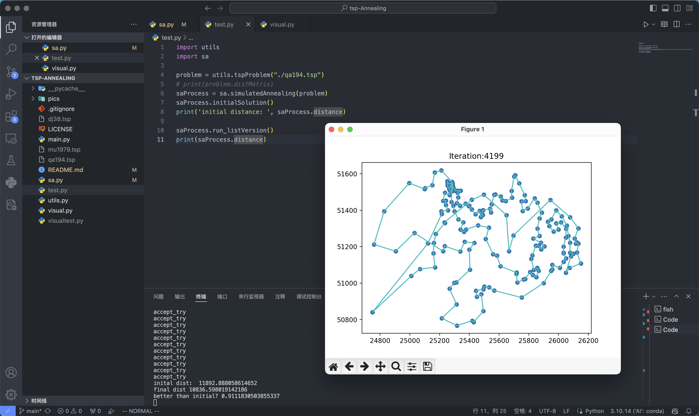

# 使用模拟退火计算旅行商问题

效果图：

# 构成
- `utils.py`：预处理数据函数
- `sa.py`：模拟退火算法的具体实现
- `visual.py`：可视化函数
- `main.py`：运行这个文件，调用模拟退火算法

# TO-DO
- 选择矩阵版本 

# 数据
数据来源于此处：[National Traveling Salesman Problems](https://www.math.uwaterloo.ca/tsp/world/countries.html)